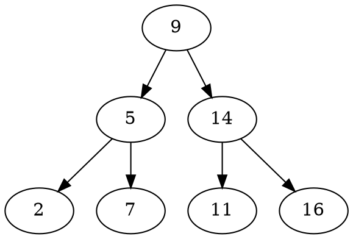
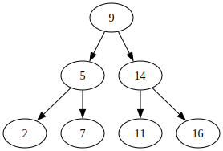

# Herhaling C++ — Binaire zoekbomen

Tijdens deze eerste sessie zal je jouw ontwikkelomgeving verifiëren en enkele belangrijke C++-concepten herhalen. Meer specifiek wordt de focus gelegd op **pointers, referenties en klassen**. Deze concepten worden opgefrist aan de hand van een **binaire zoekboom**.

## Ontwikkelingomgeving

In de [Documentatie](https://github.ugent.be/Algoritmen-2025/Installation-Documentation) vind je de specifieke _toolchain_/ontwikkelomgeving die wordt gebruikt bij de oefeningen (en testen) van **Algoritmen**.

## Binaire zoekbomen

Een binaire zoekboom is een boomstructuur met volgende eigenschappen:

* Een knoop heeft maximaal twee kinderen. Elke knoop kan dus worden gezien als de wortel van een nieuwe boom, die op zijn beurt bestaat uit maximaal twee deelbomen: de linkerdeelboom, en de rechterdeelboom (**recursieve betrekking**).
* De sleutels in de linkerdeelboom van een knoop zijn steeds **kleiner** dan de sleutel van die knoop.
* De sleutels in de rechterdeelboom van een knoop zijn steeds **groter** dan de sleutel van die knoop.

De typische operaties bij bomen zijn:

* het zoeken van een sleutel,
* het toevoegen van een sleutel,
* het verwijderen van een sleutel.

> ⚠️ Hoe zou je deze operaties implementeren voor een binaire zoekboom?

### Opdracht

Bekijk de _header-only_ bestanden [`tree.hpp`](include/tree.hpp) en [`node.hpp`](include/node.hpp). Deze bestanden bevatten een gedeeltelijke implementatie van de klassen `Tree<K>` en `Node<K>`.

```cpp
template <std::integral K>
class Tree {

public:

    Node<K>* root = nullptr;

    Tree() {}
};
```

```cpp
template <std::integral K>
class Node {

public:

    K key;
    Node* leftChild = nullptr;
    Node* rightChild = nullptr;

    Node(K _key) : key(_key) {}
};
```

Vul alvast beide klassen aan met een **destructor**. Via de destructor worden **memory leaks** vermeden!

#### Elementaire operaties: toevoegen

Gegeven de klasse `Tree<H>`. Voeg de `public` methode

```cpp
void add(K key)
```

toe, die een (knoop met een) sleutel op de juiste plaats in de boom toevoegt. Definieer hiervoor eveneens de `private` (hulp)methode

```cpp
void add(Node<K>** target, K key)
```

Maak hierbij gebruik van de recursieve eigenschap van bomen om de juiste plaats te vinden waar een knoop moet worden toegevoegd.

#### Een boom uitschrijven

Bekijk de `enum traversal_order`. Deze beschrijft de drie manieren waarop een boom kan worden overlopen.

Definieer de `public` methode

```cpp
template <traversal_order _o>
void traverse(const std::function<void(const Node<K>*)>& fun) const
```

die de boom volgens een gegeven _traversal order_ doorloopt, en per knoop de (anonieme) functie `fun` oproept. Ook hier kan een `private` hulp(methode) van pas komen.

Maak gebruik van bovenstaande functies om de `operator<<`-methode aan te vullen, die een boom uitschrijft in **dot**-notatie ([Graphviz documentatie](https://graphviz.org/doc/info/lang.html)). Doe dit door de boom te overlopen in **preorder** volgorde.

Een voorbeeld. De dot-notatie



geeft de volgende structuur:



> ⚠️ Voor het weergeven van `.dot` bestanden kan de VSCode extensie **Graphviz Interactive Preview** worden gebruikt.

#### Elementaire operaties: verwijderen

Voeg de `public` methode

```cpp
void remove(K key)
```

toe, die de knoop horende bij een gegeven sleutel verwijdert. Definieer hiervoor eveneens de `private` (hulp)methode

```cpp
void remove(Node<K>** target, K key)
```

Denk na over welke situaties zich kunnen voordoen. De knoop voor de gegeven sleutel wordt al dan niet gevonden, en heeft:

* geen kinderen (een blad-knoop),
* één kind,
* twee kinderen.


#### Elementaire operaties: zoeken

Voeg de `public` methode

```cpp
Node<K>* find(K key)
```

toe, die een pointer naar de knoop horende bij een gegeven sleutel teruggeeft. Definieer hiervoor eveneens de `private` hulp(methode)

```cpp
Node<K>* find(Node<K>* target, K key)
```

#### Uitgebreid zoeken

Voeg tot slot de `public` methode

```cpp
std::vector<K> range(K low, K high) const
```

toe, die een `vector` teruggeeft van alle sleutels die zich binnen een bepaald bereik bevinden. Definineer hiervoor de `private` (hulp)methode

```cpp
void range(const Node<K>* target, K low, K high, std::vector<K>& res) const
```

### Overzicht

Bekijk de `main`-functie in [`recap.cpp`](apps/recap.cpp), en ga na hoe de `traverse`-methode kan worden gebruikt met (anonieme) functies.