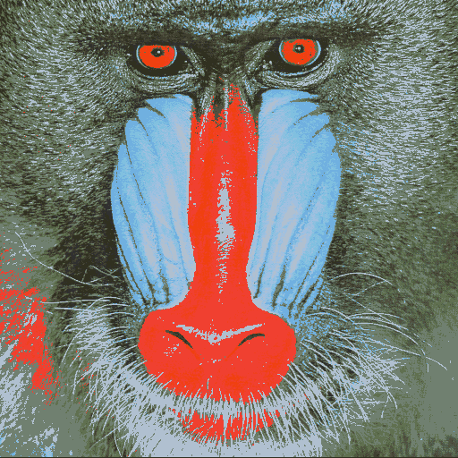
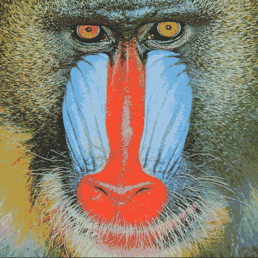
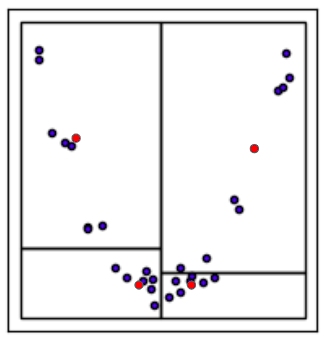

# K-D Tree: Kleurkwantisatie

## Inleiding
Kleurkwantisatie is een techniek om het aantal kleuren in een afbeelding te verminderen, zodat de gekwantiseerde afbeelding visueel zo veel mogelijk lijkt op de originele afbeelding. Dit wordt vaak gebruikt in toepassingen met beperkte geheugencapaciteit en dus een beperkte kleurenpalet. We kunnen een kleurkwantisatie-algoritme opdelen in twee stappen. Eerst wordt een gereduceerd kleurenpalet gegenereerd, daarna wordt elke pixel in de originele afbeelding vervangen door een kleur uit het gereduceerde palet. In deze opdracht zal je hiervoor gebruik maken van een K-D tree. De onderstaande afbeelding toont een voorbeeld van een afbeelding voor en na kwantisatie. Je zal je methode ook vergelijken met een naïef algoritme die een kleurenpalet samenstelt op basis van de meest voorkomende kleuren in de originele afbeelding.

|   |  |  |
|:---:|:---:|:---:|
| Origineel | Naïef | K-D tree |

## Implementatiedetails
Voor deze opdracht mag je de C++ `algorithm` bibliotheek gebruiken. Deze bibliotheek bevat een verscheidenheid aan functies die werken op reeksen elementen (bijv. zoeken, sorteren, manipuleren). Enkele functies die waarschijnlijk handig zullen zijn (je bent uiteraard vrij om andere functies te gebruiken):
* `std::nth_element`
* `std::minmax_element`
* `std::transform`

`main.cpp` bevat functies om afbeeldingsbestanden in te lezen en op te slaan. Een afbeelding wordt gerepresenteerd door een vector van elementen van het type `Color`. De klasse `Color` bevat de RGB-waarden van een enkele pixel en implementeert enkele nuttige functies voor het vergelijken, middelen en meten van de Euclidische afstand tussen kleuren.

Je kunt de klasse `Chrono` gebruiken om de uitvoeringstijd van je code te meten.

## Naïeve aanpak
We hebben al een naïeve aanpak geïmplementeerd. Deze methode stelt een kleurenpalet samen door de meest voorkomende kleuren in de afbeelding te selecteren. Nadat het palet is gecreëerd, wordt elke kleur in de originele afbeelding vervangen door de dichtstbijzijnde kleur uit het palet. Merk op dat deze techniek een minder nauwkeurig kleurenpalet genereert dan de volgende K-D tree methode, en dus mogelijk sneller is qua uitvoeringstijd.

## Algoritme met K-D tree
Een slimmere aanpak voor het kleurkwantisatieprobleem maakt gebruik van een aangepaste K-D tree (we passen de klassieke K-D tree aan voor onze behoeften bij kleurkwantisatie). We implementeren deze functionaliteit in de klassen `KdColorQuantizer` en `KdTree`.  Knopen worden voorgesteld door objecten van de klasse `KdNode`. Het bouwen van de boom bestaat uit de volgende stappen:
 * In plaats van af te wisselen tussen de K dimensies, bepaal bij elke knoop de dimensie met het grootste bereik ($v_{\textit{max}} - v_{\textit{min}}$). Dit zal een van de drie kleurkanalen zijn (rood, groen of blauw). Sla dit op in het veld `splitDim` van het `KdNode`-object.
 * Splits de verzameling kleuren op basis van de mediaan van het geselecteerde kleurkanaal. We slaan de mediaan op in de variabele `value` van het `KdNode`-object. De linkerhelft van de pixels (pixels waarvan de kleurwaarde van het geselecteerde kanaal kleiner is dan de mediaan) wordt toegewezen aan het linkerkind, de rechterhelft aan het rechterkind.
 * Stop wanneer de boom het gewenste aantal bladknopen heeft bereikt (d.w.z. het aantal kleuren in het gereduceerde palet). Je mag ervan uitgaan dat het aantal kleuren een macht van twee is.
 * Voor elke bladknoop, bereken het gemiddelde van alle kleuren van de originele afbeelding die tot deze knoop behoren. Elke bladknoop komt overeen met een volume in een driedimensionale ruimte (de RGB-ruimte). De kleuren binnen een bladknoop zijn de kleuren van de originele afbeelding die zich binnen dit volume bevinden.
 * Sla het gemiddelde op in het veld `color`. Deze variabele wordt alleen gebruikt door de bladknopen van de boom.

De onderstaande afbeelding toont een voorbeeld in twee dimensies.
Elke rechthoek komt overeen met een blad van de boom, de blauwe stippen zijn kleuren uit de originele afbeelding, de rode stippen zijn de gemiddelden. In onze toepassing zouden de rode stippen overeenkomen met de kleuren die het gereduceerde palet vormen.

Om een afbeelding te kwantiseren:
 * Itereer over alle pixels.
 * Voor elke pixel wordt de boom doorlopen tot een bladknoop is bereikt.
 * Vervang de originele pixel door de kleur verkregen uit de bladknoop.

Wat is de complexiteit van het opbouwen van een kleurenpalet en het kwantiseren van een afbeelding? Je kunt dit empirisch valideren door de uitvoeringstijd van je code te meten voor afbeeldingen met verschillende afmetingen en verschillende groottes van het kleurenpalet.
