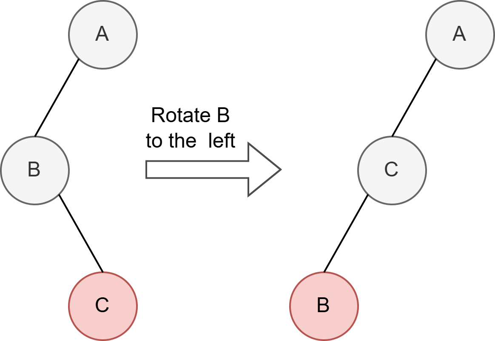
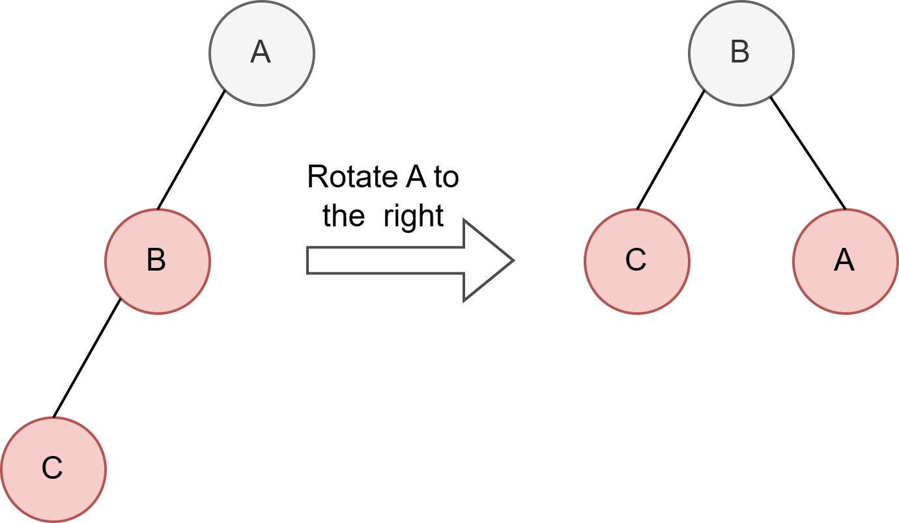
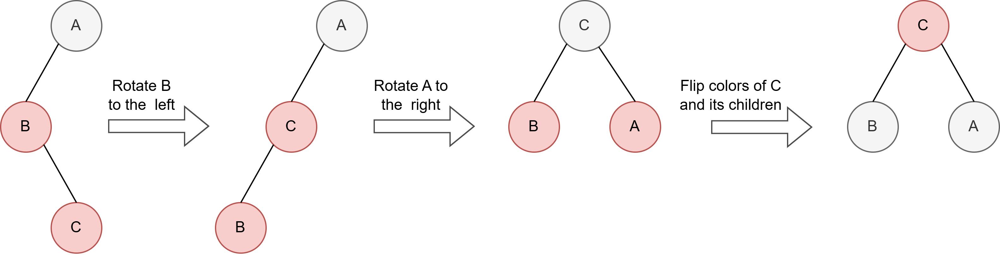
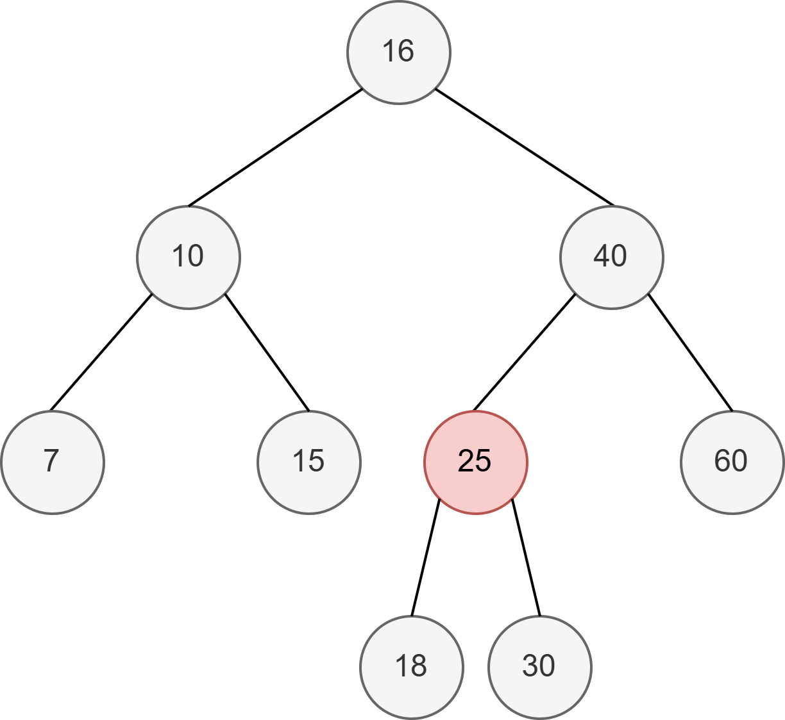
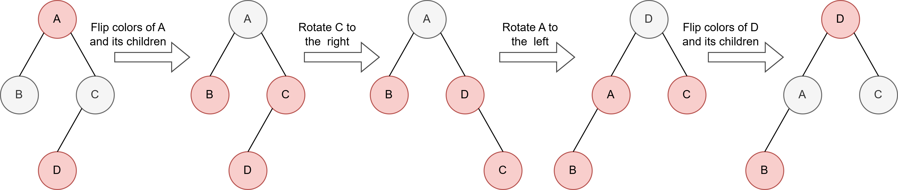
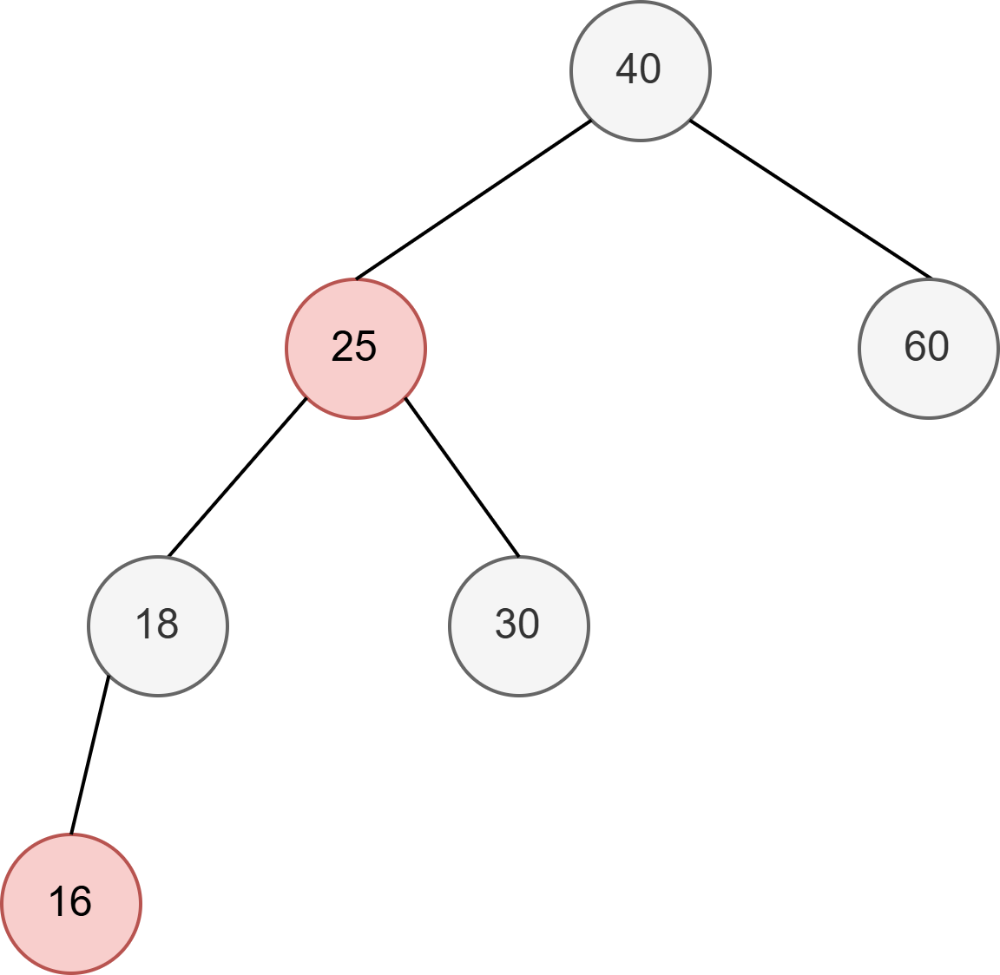

# Links leunende rood-zwarte boom

Een **links leunende rood-zwarte boom** is een variant van de rood-zwarte boom die het balanceringsmechanisme vereenvoudigt. In tegenstelling tot een standaard rood-zwarte boom, waarbij beide kinderen rood kunnen zijn, staat een links leunende rood-zwarte boom **alleen rode knopen toe als linker kind**. Dit betekent dat een rechter kind niet rood mag zijn. Als dat toch het geval is, worden rotaties toegepast om dit te corrigeren.

Gegeven is een implementatie van een **binaire zoekboom**. Jullie taak is om de functies `insert` en `deleteMin` te implementeren voor een links leunende rood-zwarte boom.

## Rotaties

Om ervoor te zorgen dat de boom blijft voldoen aan de eigenschappen van een links leunende rood-zwarte boom na een toevoeg- of verwijderoperatie, maken we gebruik van **rotaties**. De algemene werking van rotaties wordt in de cursus beschreven voor de klassieke rood-zwarte boom. Voor een links leunende rood-zwarte boom zijn rotaties analoog met het verschil dat na de rotatie **ook een kleurwijziging plaatsvindt**:

 * **Rotatie naar links**  
  Het oorspronkelijke rechter kind van de geroteerde knoop krijgt de kleur van de geroteerde knoop, en de geroteerde knoop wordt rood gemaakt.
 * **Rotatie naar rechts**  
  Het oorspronkelijke linker kind van de geroteerde knoop krijgt de kleur van de geroteerde knoop, en de geroteerde knoop wordt rood gemaakt.

Verder zijn visualisaties beschikbaar van de verschillende rotaties.

  
   

## Een knoop toevoegen

Het toevoegen van een knoop gebeurt volgens een **bottom-up** aanpak.  

1. De nieuwe knoop wordt toegevoegd zoals in een standaard rood-zwarte boom en krijgt de kleur **rood**.
2. Na het toevoegen moeten mogelijk **rotaties en kleurwijzigingen** worden toegepast om de eigenschappen van een links leunende rood-zwarte boom te behouden (hieronder zie je een voorbeeld waarbij beide rotaties en de kleurwijziging moeten worden uitgevoerd):
   * Rode knopen moeten altijd het **linker kind** zijn van hun ouder. Als een rode knoop als **rechter kind** verschijnt en het linker kind is zwart, wordt een **rotatie naar links** uitgevoerd.
   * Een rode knoop moet steeds **twee zwarte kinderen** hebben. Wanneer er **twee opeenvolgende rode knopen** aan de linkerkant voorkomen, wordt een **rotatie naar rechts** uitgevoerd.
   * Wanneer een knoop **twee rode kinderen** heeft, moet een **kleurwijziging** plaatsvinden. De kleur van de node en zijn kinderen worden omgedraaid.
3. Bovenstaande procedure wordt herhaald tot in de wortel van de boom.
4. Tot slot wordt de wortel zwart gemaakt.

  

### Oefening

Voordat je aan je implementatie begint, voer je de volgende oefening uit op papier:  
**Voeg de volgende sleutels toe aan een initieel lege boom:**
10, 18, 7, 15, 16, 30, 25, 40, 60

Controleer of de resulterende boom correct is.

  

## Het minimum verwijderen

Het doel is om de **onderste, meest linkse knoop** te verwijderen, terwijl de eigenschappen van een links leunende rood-zwarte boom behouden blijven.  

1. **Het vinden van de te verwijderen knoop**  
We willen dat de te verwijderen knoop rood is, zodat de zwarte hoogte niet verstoord wordt. Dit doen we door ervoor te zorgen dat de te verwijderen knoop rood gemaakt kan worden.
* Volg steeds het **linker kind** totdat een blad wordt bereikt, **tenzij** het linker kind en het linker kleinkind van de huidige knoop **zwart** zijn. In dit geval wordt een **kleurwijziging** uitgevoerd: de huidige knoop en zijn niet-virtuele kinderen worden van kleur gewisseld. Let op, virtuele knopen worden als zwart beschouwd, dus dit geldt ook als het linker kleinkind een virtuele knoop is.
* Vorige stap kan opeenvolgende rode knopen aan de rechterkant introduceren. Dit wordt gecorrigeerd met **twee rotaties en een kleurwijziging**:
    1. **Rotatie naar rechts** op het rechter kind.
    2. **Rotatie naar links** op de huidige knoop.
    3. **Kleurwijziging** uitvoeren, de kleur van de node en zijn kinderen worden omgedraaid.
    
    Hieronder zie je een voorbeeld waarin tijdens het afdalen een knoop wordt bereikt waarvan zowel het linker kind als het linker kleinkind zwart zijn. Door de kleurwissel ontstaan twee opeenvolgende rode knopen aan de rechterkant waardoor twee rotaties en een kleurwijziging nodig zijn om te herbalanceren.

2. **Herbalanceren na verwijdering**  
    Indien nodig moet de boom opnieuw in balans gebracht worden, analoog aan het toevoegen van een knoop (**bottom-up** correcties):

    * **Een rode knoop als rechter kind:** voer een rotatie naar links uit. Merk op dat we hier geen rekening dienen te houden met de kleur van het linker kind als bij het toevoegen wel het geval was
    * **Twee opeenvolgende rode knopen aan de linkerkant:** voer een rotatie naar rechts uit.
    * **Een knoop met twee rode kinderen:** voer een kleurwijziging uit, de kleur van de node en zijn kinderen worden omgedraaid.

    Bovenstaande procedure dient opnieuw herhaald te worden tot in de wortel van de boom. Tot slot moet de wortel opnieuw zwart gemaakt worden.

  

### Oefening

Voordat je aan je implementatie begint, voer je de volgende oefening uit op papier: **Verwijder de drie kleinste sleutels van de boom verkregen in de vorige oefening**.

Controleer of de resulterende boom correct is.

  

